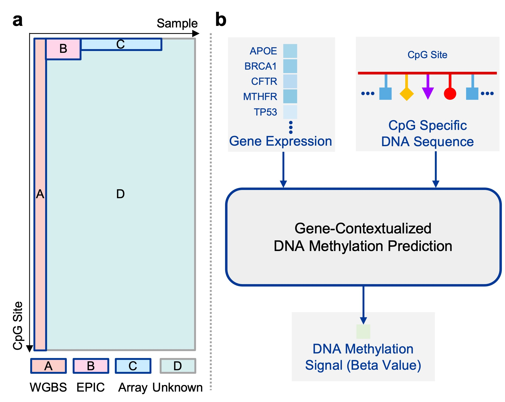
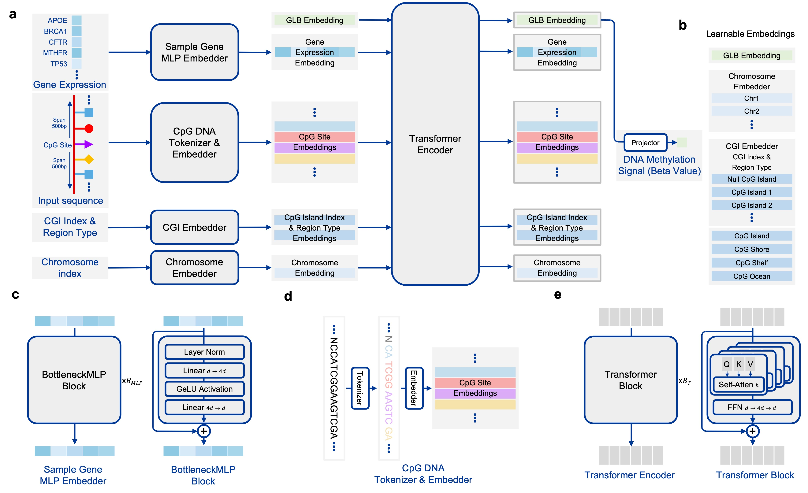

<div align="center">
<h1>
  <b>MethylProphet</b>: A Generalized Gene-Contextual Model for Inferring Whole-Genome DNA Methylation Landscape
</h1>

<div>
    <a href="https://xk-huang.github.io/">
        Xiaoke Huang<sup>1</sup>
    </a>&emsp;
    <a href="https://www.qi-liu.com/">
        Qi Liu<sup>2</sup>
    </a>&emsp;
    <a href="https://www.linkedin.com/in/yifei-zhao1914">
        Yifei Zhao<sup>2</sup>
    </a>&emsp;
    <a href="https://xta.ng/">
        Xianfeng Tang<sup>3</sup>
    </a>&emsp;
    <a href="https://yuyinzhou.github.io/">
        Yuyin Zhou<sup>1</sup>
    </a>&emsp;
    <a href="https://winnie09.github.io/Wenpin_Hou/">
        Wenpin Hou<sup>2</sup>
    </a>
</div>

<strong><sup>1</sup>UC Santa Cruz, <sup>2</sup>Columbia University, <sup>3</sup>Amazon </strong>
</div>

This repository contains codes, data, protocols, models, and results of "MethylProphet: A Generalized Gene-Contextual Model for Inferring Whole-Genome DNA Methylation Landscape" ([bioRxiv](https://www.biorxiv.org/content/early/2025/02/08/2025.02.05.636730.full.pdf)).

<details>
<summary>Abstract</summary>
DNA methylation (DNAm), an epigenetic modification, regulates gene expression, influences phenotypes, and encodes inheritable information, making it critical for disease diagnosis, treatment, and prevention. While human genome contains approximately 28 million CpG sites where DNAm can be measured, only 1–2% of these sites are typically available in most datasets due to complex experimental protocols and high costs, hindering insights from DNAm data. Leveraging the relationship between gene expression and DNAm offers promise for computational inference, but existing statistical, machine learning, and masking-based generative transformers face critical limitations: they cannot infer DNAm at unmeasured CpGs or in new samples effectively. To overcome these challenges, we introduce MethylProphet, a gene-guided, context-aware Transformer model designed for DNAm inference. MethylProphet employs a Bottleneck MLP for efficient gene profile compression and a specialized DNA sequence tokenizer, integrating global gene expression patterns with local CpG context through a Transformer encoder architecture. Trained on whole-genome bisulfite sequencing data from ENCODE (1.6B training CpG-sample pairs; 322B tokens), MethylProphet demonstrates strong performance in hold-out evaluations, effectively inferring DNAm for unmeasured CpGs and new samples. In addition, its application to 10842 pairs of gene expression and DNAm samples at TCGA chromosome 1 (450M training CpG-sample pairs; 91B tokens) highlights its potential to facilitate pan-cancer DNAm landscape inference, offering a powerful tool for advancing epigenetic research and precision medicine.
</details>


<div align="center">
  
</div>

Task:
(a) Illustration of the scale of DNAm data. Part A, B, and C refers to existing DNAm samples. Part D refers to unmeasured CpG sites and new samples with gene expression measurements that users can apply MethylProphet to reliably predict their DNAm profiles.
(b) Given gene context of a sample, MethylProphet aims to infer whole-genome DNAm at individual CpG resolution.

<div align="center">
  
</div>

Model:
(a) Model architecture of MethylProphet; (b) The learnable Global, chromosome, and CPG island-related embeddings;
(c) Model architecture of efficient gene profile compression MLP;
(d) DNA Tokenizer for CpG-specific DNA sequence;
(e) Model architecture of Transformer encoder that aggregates all the embeddings.

## Environment Setup

Create the environment to run our code in [ENV.md](docs/ENV.md).


## Data Protocols

Download ENCODE and TCGA raw data from [DATA.md](docs/DATA.md).


## Released Model Weights

Download our model weights in [MODEL_ZOO.md](docs/MODEL_ZOO.md).


## Predicting / Training with Example / Customized Data

You can either predict methylation with our model, or train your model models with example or customized data in [CUSTOMIZED.md](docs/CUSTOMIZED.md).


## Experiments and Results

Reproduce all the experiments with this codebase [EXPERIMENTS.md](docs/EXPERIMENTS.md).


## License

MIT

## Acknowledgement

Deeply appreciate these wonderful open source projects: [transformers](https://github.com/huggingface/transformers), [PyTorch Lightning](https://lightning.ai/docs/pytorch/stable/), [ml_collections](https://github.com/google/ml_collections), [abseil-py](https://github.com/abseil/abseil-py/), and [mosaicml-streaming](https://docs.mosaicml.com/projects/streaming/en/stable/index.html).

## Citation

If you find this repository useful, please consider giving a star ⭐ and citation 🦖:

```
@article {methylprophet2025,
	author = {Huang, Xiaoke and Liu, Qi and Zhao, Yifei and Tang, Xianfeng and Zhou, Yuyin and Hou, Wenpin},
	title = {MethylProphet: A Generalized Gene-Contextual Model for Inferring Whole-Genome DNA Methylation Landscape},
	elocation-id = {2025.02.05.636730},
	year = {2025},
	doi = {10.1101/2025.02.05.636730},
	publisher = {Cold Spring Harbor Laboratory},
	URL = {https://www.biorxiv.org/content/early/2025/02/08/2025.02.05.636730},
	eprint = {https://www.biorxiv.org/content/early/2025/02/08/2025.02.05.636730.full.pdf},
	journal = {bioRxiv}
}
```

## Questions or Feedback?

For questions or discussions, please open an issue or contact the [author](https://xk-huang.github.io/).
